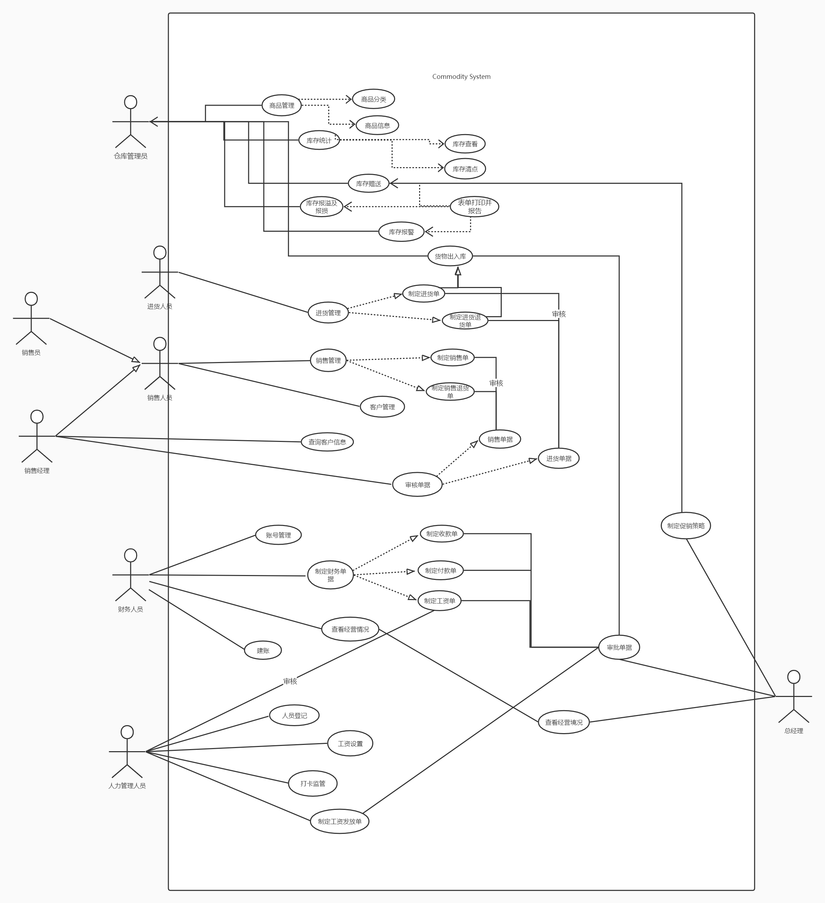

## Lab 2

> 3月21日-需求分析07

https://online.visual-paradigm.com/cn/

### 画出整个系统用例图

<u>主要问题是单据的生成和处理；是否需要进一步细分？</u>

### 完成库存模块的用例描述

<u>注意区分库存管理人员和仓库管理员</u>

#### 商品入库

<u>单据未生成；系统和实际库存数据已更新</u>

<table>
    <tr>
        <td>用例项目</td>
        <td>内容描述</td>
    </tr>
    <tr>
        <td>ID</td>
        <td>1</td>
    </tr>
    <tr>
        <td>名称</td>
        <td>商品入库</td>
    </tr>
    <tr>
        <td>参与者</td>
        <td>库存管理人员</td>
    </tr>
    <tr>
        <td>触发条件</td>
        <td>进货单或销售退货单通过审批</td>
    </tr>
    <tr>
        <td>前置条件</td>
        <td>库存管理人员必须已经被识别和授权</td>
    </tr>
    <tr>
        <td>后置条件</td>
        <td>生成并保存商品入库单，入库单内容包括含时间、操作员、入库类型、这批商品的具体信息；通知总经理进行单据审批；记录系统操作并写⼊系统⽇志</td>
    </tr>
    <tr>
        <td>正常流程</td>
        <td>
            <ol>
                <li>库存管理人员选择开始一次商品入库任务，系统响应</li>
                <li>库存管理⼈员选择入库类型，系统记录其选择并显示</li>
                <li>库存管理⼈员输入商品名称关键字或编号，系统在库存中查询对应的商品并显示</li>
                <li>库存管理⼈员输入该商品入库所需信息，系统将其保存并显示</li>
                库存管理⼈员重复 3~4 步，直到完成所有需要入库的商品信息输入
                <li>库存管理⼈员确认并结束本次商品入库任务，系统生成并保存商品入库单</li>
            </ol>
        </td>
    </tr>
    <tr>
        <td>扩展流程</td>
        <td>库存管理⼈员发现之前输入的入库信息有误</td>
    </tr>
    <tr>
        <td>特殊需求</td>
        <td></td>
    </tr>
</table>

#### 商品出库

<u>单据未生成；系统和实际库存数据已更新</u>

<table>
    <tr>
        <td>用例项目</td>
        <td>内容描述</td>
    </tr>
    <tr>
        <td>ID</td>
        <td>2</td>
    </tr>
    <tr>
        <td>名称</td>
        <td>商品出库</td>
    </tr>
    <tr>
        <td>参与者</td>
        <td>库存管理人员</td>
    </tr>
    <tr>
        <td>触发条件</td>
        <td>进货退货单或销售单通过审批</td>
    </tr>
    <tr>
        <td>前置条件</td>
        <td>库存管理人员必须已经被识别和授权</td>
    </tr>
    <tr>
        <td>后置条件</td>
        <td>生成并保存商品出库单，出库单内容包括含时间、操作员、出库类型、这批商品的具体信息；通知总经理进行单据审批；记录系统操作并写⼊系统⽇志</td>
    </tr>
    <tr>
        <td>正常流程</td>
        <td>
            <ol>
                <li>库存管理人员选择开始一次商品出库任务，系统响应</li>
                <li>库存管理⼈员选择出库类型，系统记录其选择并显示</li>
                <li>库存管理⼈员输出商品名称关键字或编号，系统在库存中查询对应的商品并显示</li>
                <li>库存管理⼈员输出该商品出库所需信息，系统将其保存并显示</li>
                库存管理⼈员重复 3~4 步，直到完成所有需要出库的商品信息输出
                <li>库存管理⼈员确认并结束本次商品出库任务，系统生成并保存商品出库单</li>
            </ol>
        </td>
    </tr>
    <tr>
        <td>扩展流程</td>
        <td>库存管理⼈员发现之前输入的出库信息有误</td>
    </tr>
    <tr>
        <td>特殊需求</td>
        <td></td>
    </tr>
</table>

#### 库存查看

<table>
    <tr>
        <td>用例项目</td>
        <td>内容描述</td>
    </tr>
    <tr>
        <td>ID</td>
        <td>3</td>
    </tr>
    <tr>
        <td>名称</td>
        <td>库存查看</td>
    </tr>
    <tr>
        <td>参与者</td>
        <td>库存管理人员</td>
    </tr>
    <tr>
        <td>触发条件</td>
        <td>库存管理人员通过系统查看库存</td>
    </tr>
    <tr>
        <td>前置条件</td>
        <td>库存管理人员必须已经被识别和授权</td>
    </tr>
    <tr>
        <td>后置条件</td>
        <td>记录系统操作并写⼊系统⽇志</td>
    </tr>
    <tr>
        <td>正常流程</td>
        <td>
            <ol>
                <li>库存管理人员设定查看的时间段</li>
                <li>系统显示此时间段内的出/入库数量/金额/商品信息/分类信息</li>
            </ol>
        </td>
    </tr>
    <tr>
        <td>扩展流程</td>
        <td></td>
    </tr>
    <tr>
        <td>特殊需求</td>
        <td></td>
    </tr>
</table>

#### 库存盘点

<table>
    <tr>
        <td>用例项目</td>
        <td>内容描述</td>
    </tr>
    <tr>
        <td>ID</td>
        <td>4</td>
    </tr>
    <tr>
        <td>名称</td>
        <td>库存盘点</td>
    </tr>
    <tr>
        <td>参与者</td>
        <td>库存管理人员</td>
    </tr>
    <tr>
        <td>触发条件</td>
        <td>库存管理人员通过系统盘点库存</td>
    </tr>
    <tr>
        <td>前置条件</td>
        <td>库存管理人员必须已经被识别和授权</td>
    </tr>
    <tr>
        <td>后置条件</td>
        <td>记录系统操作并写⼊系统⽇志</td>
    </tr>
    <tr>
        <td>正常流程</td>
        <td>
            <ol>
                <li>库存管理人员申请查看当天的库存快照</li>
                <li>系统显示当天的各种商品的名称，型号，库存数量，库存均价（商品的平均进价），批次批号，生产日期</li>
            </ol>
        </td>
    </tr>
    <tr>
        <td>扩展流程</td>
        <td></td>
    </tr>
    <tr>
        <td>特殊需求</td>
        <td>
        </td>
    </tr>
</table>

#### 库存赠送

<u>单据已生成；系统和实际库存数据未更新</u>

<table>
    <tr>
        <td>用例项目</td>
        <td>内容描述</td>
    </tr>
    <tr>
        <td>ID</td>
        <td>5</td>
    </tr>
    <tr>
        <td>名称</td>
        <td>库存赠送</td>
    </tr>
    <tr>
        <td>参与者</td>
        <td>库存管理人员</td>
    </tr>
    <tr>
        <td>触发条件</td>
        <td>库存赠送单据通过审批</td>
    </tr>
    <tr>
        <td>前置条件</td>
        <td>库存管理人员必须已经被识别和授权</td>
    </tr>
    <tr>
        <td>后置条件</td>
        <td>更新系统库存数据；记录系统操作并写⼊系统⽇志</td>
    </tr>
    <tr>
        <td>正常流程</td>
        <td>
            <ol>
                <li>库存管理人员选择开始一次库存赠送任务，系统响应</li>
                <li>库存管理⼈员输出商品名称关键字或编号，系统在库存中查询对应的商品并显示</li>
                <li>库存管理⼈员输出该商品出库所需信息，系统将其保存并显示</li>
                库存管理⼈员重复 2~3 步，直到完成所有需要赠送的商品信息输出
                <li>库存管理⼈员确认库存赠送信息，并向仓库管理员发送消息</li>
                <li>仓库管理员完成现实中商品的出货</li>
            </ol>
        </td>
    </tr>
    <tr>
        <td>扩展流程</td>
        <td>
            <ol>
                <li>商品数量不足，系统回滚操作</li>
                <li>出库后商品数量为零，删去该商品的分类</li>
            </ol>        
        </td>
    </tr>
    <tr>
        <td>特殊需求</td>
        <td>
        </td>
    </tr>
</table>

#### 库存报溢

<u>单据未生成；系统库存数据未更新</u>

<table>
    <tr>
        <td>用例项目</td>
        <td>内容描述</td>
    </tr>
    <tr>
        <td>ID</td>
        <td>6</td>
    </tr>
    <tr>
        <td>名称</td>
        <td>库存报溢</td>
    </tr>
    <tr>
        <td>参与者</td>
        <td>库存管理人员</td>
    </tr>
    <tr>
        <td>触发条件</td>
        <td>实际库房中的商品数量与系统中的多</td>
    </tr>
    <tr>
        <td>前置条件</td>
        <td>库存管理人员必须已经被识别和授权</td>
    </tr>
    <tr>
        <td>后置条件</td>
        <td>生成并保存库存报溢单；更新系统库存数据；记录系统操作并写⼊系统⽇志</td>
    </tr>
    <tr>
        <td>正常流程</td>
        <td>
            <ol>
                <li>库存管理人员选择开始一次库存报溢任务，系统响应</li>
                <li>库存管理⼈员输出商品名称关键字或编号，系统在库存中查询对应的商品并显示</li>
                <li>库存管理⼈员输出该商品在实际库房中多的数量，系统将其保存并显示</li>
                库存管理⼈员重复 2~3 步，直到完成所有需要报溢的商品信息输出
                <li>库存管理⼈员确认并结束本次库存报溢任务，系统生成并保存库存报溢单</li>
                <li>库存报溢单通过审批后，系统自动在库存中减少商品使一致</li>
            </ol>
        </td>
    </tr>
    <tr>
        <td>扩展流程</td>
        <td>  
        </td>
    </tr>
    <tr>
        <td>特殊需求</td>
        <td>
        </td>
    </tr>
</table>

#### 库存报损

<u>单据未生成；系统库存数据未更新</u>

<table>
    <tr>
        <td>用例项目</td>
        <td>内容描述</td>
    </tr>
    <tr>
        <td>ID</td>
        <td>7</td>
    </tr>
    <tr>
        <td>名称</td>
        <td>库存报损</td>
    </tr>
    <tr>
        <td>参与者</td>
        <td>库存管理人员</td>
    </tr>
    <tr>
        <td>触发条件</td>
        <td>实际库房中的商品数量与系统中的少</td>
    </tr>
    <tr>
        <td>前置条件</td>
        <td>库存管理人员必须已经被识别和授权</td>
    </tr>
    <tr>
        <td>后置条件</td>
        <td>生成并保存库存报损单；更新系统库存数据；记录系统操作并写⼊系统⽇志</td>
    </tr>
    <tr>
        <td>正常流程</td>
        <td>
            <ol>
                <li>库存管理人员选择开始一次库存报损任务，系统响应</li>
                <li>库存管理⼈员输出商品名称关键字或编号，系统在库存中查询对应的商品并显示</li>
                <li>库存管理⼈员输出该商品在实际库房中少的数量，系统将其保存并显示</li>
                库存管理⼈员重复 2~3 步，直到完成所有需要报损的商品信息输出
                <li>库存管理⼈员确认并结束本次库存报损任务，系统生成并保存库存报损单</li>
                <li>库存报损单通过审批后，系统自动在库存中增加商品使一致</li>
            </ol>
        </td>
    </tr>
    <tr>
        <td>扩展流程</td>
        <td>系统在库存中查询不到对应的商品</td>
    </tr>
    <tr>
        <td>特殊需求</td>
        <td></td>
    </tr>
</table>

#### 库存报警

<u>单据未生成</u>

<table>
    <tr>
        <td>用例项目</td>
        <td>内容描述</td>
    </tr>
    <tr>
        <td>ID</td>
        <td>8</td>
    </tr>
    <tr>
        <td>名称</td>
        <td>库存报警</td>
    </tr>
    <tr>
        <td>参与者</td>
        <td>库存管理人员</td>
    </tr>
    <tr>
        <td>触发条件</td>
        <td>系统库存数量低于警戒数量</td>
    </tr>
    <tr>
        <td>前置条件</td>
        <td>库存管理人员必须已经被识别和授权</td>
    </tr>
    <tr>
        <td>后置条件</td>
        <td>生成库存报警单；记录系统操作并写⼊系统⽇志</td>
    </tr>
    <tr>
        <td>正常流程</td>
        <td>
            <ol>
               <li>库存管理人员选择开始一次库存报警任务，系统响应</li>
                <li>库存管理⼈员输出商品名称关键字或编号，系统在库存中查询对应的商品并显示</li>
                <li>库存管理⼈员输出该商品比警戒数量低的数量，系统将其保存并显示</li>
                库存管理⼈员重复 2~3 步，直到完成所有需要报警的商品信息输出
                <li>库存管理⼈员确认并结束本次库存报警任务，系统生成并保存库存报警单</li>
                <li>库存报警单通过审批后，向仓库管理员发送消息</li>
            </ol>
        </td>
    </tr>
    <tr>
        <td>扩展流程</td>
    </tr>
    <tr>
        <td>特殊需求</td>
        <td></td>
    </tr>
</table>

