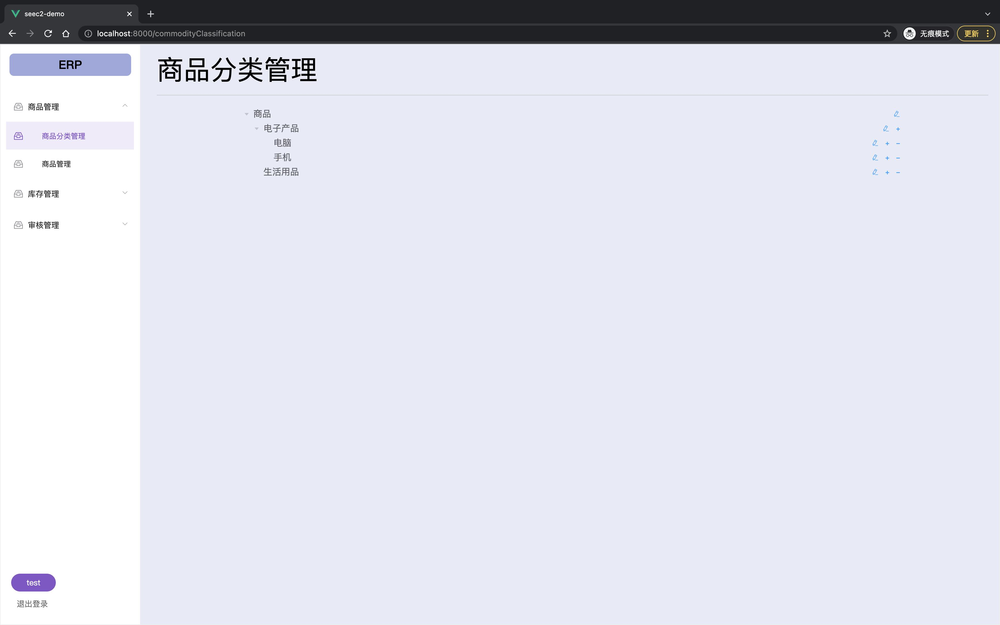
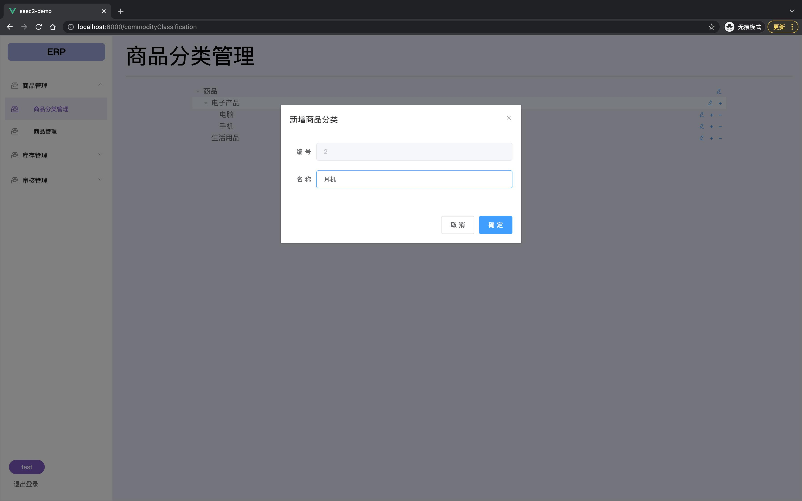
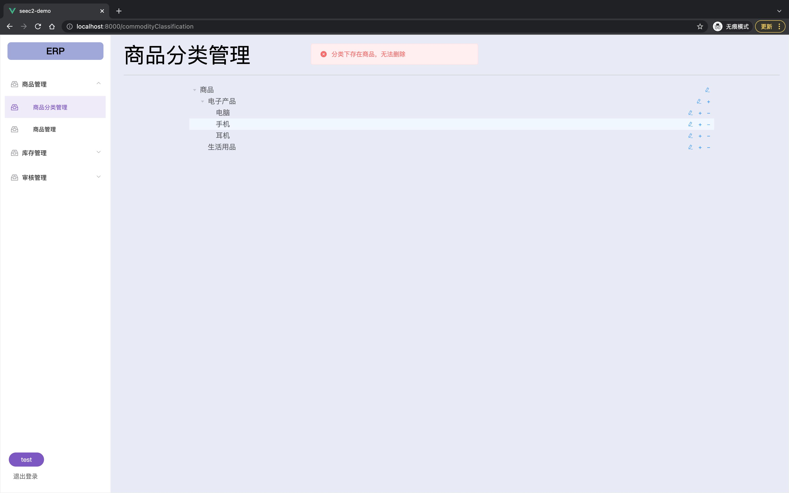
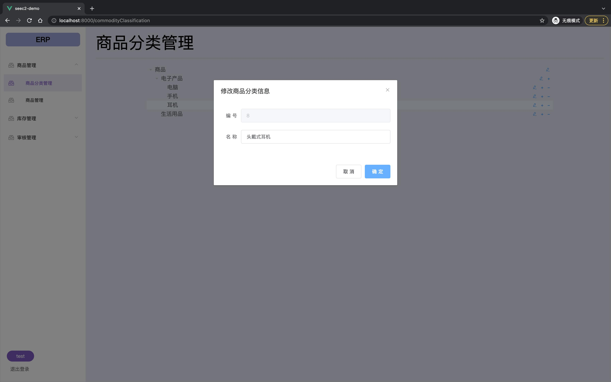

# 销售模块需求规格说明书

## 小组人员名单及分工

17组

组长： 杨昊锦 201250013 Lab4引言及总体描述

组员：凌毓辰 201250007 Lab3

​           丁宇辰 201250012 Lab3

​            胡睿 201250026 Lab4详细需求描述

## 1.引言

### 1.1 目的

本文档描述了连锁商店管理系统(MSCS)的功能需求和非功能需求。

### 1.2 范围

本产品作为为企业定制的ERP系统的重要模块之一，目标在于适应企业规模扩大需求，提高企业效率。本模块更加注重通过自动化处理简化人力资源，从而提高销售效率，增加销售额，提高财务人员和人力资源人员工作效率，为经理的决策做支持。

### 1.3 参考文献

1. [南京大学软件工程与计算II课件08-需求文档化与验证 ](http://seec-helper-pdf.oss-cn-hangzhou.aliyuncs.com/slide/288/08-需求文档化与验证.pdf?Expires=1649034561&OSSAccessKeyId=LTAI4Fi1qmL4iuhH8t7G7r2H&Signature=X6zw6oqnEeAcVR56Jz68hrUnQOA%3D)
2. IEEE标准
3. 软件开发的技术基础-附录D

## 2. 总体描述

### 2.1 商品前景

#### 2.1.1 背景与机遇

一民营企业专业从事灯具开关行业，是某著名开关品牌的南京地区总代理，主要在南京负责品牌的推广及项目的落地销售、分销的批发等工作，服务对象包括项目业主、施工单位、分销商、设计院、终端用户等。
       现公司规模扩大，企业业务量、办公场所、员工数都发生增长，为适应新的环境，提高工作效率和用户满意度， 该公司聘南鲸软件科技公司开发一套ERP 系统。该系统主要包括库存管理、销售管理、财务管理、人事管理和企业经营管理。

本产品旨在帮助企业优化销售模式，提高员工效率，实现自动化管理。

#### 2.1.2 业务需求

**BR1**: 系统上线运行六个月后，减少积压的库存，增加销售额。

度量：检查月均销售额

**BR2**： 提高财务人员和人力资源人员工作效率，为经理的决策做支持。

度量：单位天数内销售总量

### 2.2  商品功能

**SF1**：访问用户信息数据库，对用户信息进行增删查改

**SF2**：协助销售员生成销售表单

**SF3**：帮助经理查询特定用户信息

**SF4**：将销售表单交给经理审批

**SF5**：帮助销售员完成销售退货处理

**SF6**：每次操作都会记录在系统日志中

### 2.3 用户特征

| 用户     |                             特征                             |
| -------- | :----------------------------------------------------------: |
| 销售员   | 4到8名。负责完成销售单，每天有大量的销售任务，且每日还要多次中断实现销售退货。由于任务多且与财务密切相关，每天要花大量时间使用软件系统。销售员的计算机操作能力一般。 |
| 销售经理 | 有1-2名销售经理，每天进行一次店内的商品库存分析，每周内进行1-2次商品的入库和报废。他们拥有相对更大的折扣权限。并且可以通过系统查询特定的用户信息。每日都要对生成的销售单审批。 |
| 总经理   |             查询经营历程表，对销售表单二次审批。             |

### 2.4 约束

**CON1**：采用Vue + Springboot + Mybatis 框架开发。

**CON2**：用户远程使用系统。

**CON3**：图形化界面操作。

### 2.5 假设和依赖

**AE1**：客户要求退货时允许将销售出的商品退回

**AE2**：系统突然中断后再次启动时可以恢复到中断前的状态

## 3.详细需求描述

### 3.1对外接口需求

#### 3.1.1用户界面

UI 1 商品分类处理 ： 系统应该使用Form风格的界面，帮助销售员使用商品管理理界面完成商品分类任务

- 用户界面：

  

- UI 1.1 新增商品分类

  

- UI 1.2 新增商品出现异常

  

- UI 1.3 修改分类信息

  

**... ...**

#### 3.1.2通信接口

CI: 客户端和服务器使用RMI的方式通信

### 3.2功能需求

#### 3.2.1销售处理

##### 3.2.2.1 特性描述

客户携带购买商品到达销售台，销售人员（经过验证）开始处理销售，完成商品录入，账单计算，赠品计算，库存更新和打印收据，生成并保存销售单；记录系统操作并写⼊系统⽇志

##### 3.2.1.2 刺激/响应序列

刺激：销售员输入客户编号

响应：系统标记销售任务的客户

刺激：销售员输入商品标识和数量

响应：系统显示商品信息，计算价格

刺激：销售员取消销售任务

响应：系统关闭销售任务

刺激：销售员删除已输入商品

响应：系统再商品列表删除该商品

刺激：销售员要求结账，输入付款信息

响应：系统计算账款，显示赠品、找零、更新数据、打印数据、关闭当前销售任务，开始下一次销售

##### 3.2.1.3相关功能需求

<table>
    <tr>
        <td>Sale.Input 
            Sale.Input.Member 
            Sale.Input.Payment 
            Sale.Input.Cancle 
            Sale.Input.Del 
            Sale.Input.Goods 
            Sale.Input.Invalid
        </td>
        <td>系统应该允许销售员在销售任务中进行键盘输人 
在销售员请求输入会员客户编号时，系统要标记会员，参见Sale.Member 在销售员输入结束商品输入命令时，系统要执行结账任务，参见Sale.Payment 在销售员输入取消命令时，系统关闭当前销售任务，开始一个新的销售任务 在销售员输入删除已输入商品命令时，执行删除已输入商品命令，参见Sale.Del 在销售员输人商品目录中存在的商品标识时，系统执行商品输入任务，参见Sale.Goods 
在销售员输入其他标识时，系统显示输入无效
</td>
    </tr>
    <tr>
    <td>Sale.Member.Start Sale.Member.Notstart 
Sale.Member.Cancle 
        Sale.Member. ValidSale.Member.Valid.List Sale.Member.Invalid</td>
        <td>在销售任务最开始时请求标记会员，系统要允许销售员进行输入 不是在销售任务最开始时请求标记会员，系统不予处理 在销售员取消会员输入时，系统关闭会员输入任务，返回销售任务，参见Sale.Input 
在销售员输入已有会员的客户编号时，系统显示该会员的信息 显示会员信息0.5秒之后，系统返回销售任务，并标记其会员信息在销售员输人其他输人时，系统提示输入无效</td>
         </tr>
<tr>
<td>Sale.Payment.Null Sale.Payment.Goods Sale. Payment.Gift Sale.Payment.Check 
    Sale. Payment.End
</td>
    <td>在销售员未输入任何商品就结束商品输人时，系统不做任何处理 在销售员输人一系列商品之后结束商品输人时，系统要执行结账任务 系统要处理赠品任务，参见Sale.Gift 
系统要计算总价，显示账单信息，执行结账任务，参见Sale.Check 
系统成功完成结账任务后，销售员可以请求结束销售任务，系统执行结束销售任务处理，参见Sale.End 
</td></tr>
    <tr>
    <td>Sale.Del.Null 
        Sale.Del.Goods</td>
    <td>在销售员未输入任何商品就输入删除已输入商品命令时，系统不予响应 在销售员从商品列表中选中待删除商品时，系统在商品列表中删除该商品</td>
    </tr>
    <tr>
    <td>Sale.Goods Sale.Goods.Num 
Sale.Goods.Subtotal.Special 
Sale.Goods.Subtotal.Common 
Sale.Goods.List 
Sale.Goods.List.Calculate
</td>
         <td>系统显示输入商品的信息 
如果销售员同时输人了大于等于1的整数商品数量，系统修改商品的数量为输人值，否则系统设置商品数量为1 
如果存在适用（商品标识、今天）的商品特价策略（参见BR3)，系统将该商品的特价设为特价策略的特价，并计算分项总价为（特价×数量) 
在商品是普通商品时，系统计算该商品分项总价为（商品的价格×商品的数量)在显示商品信息0.5秒之后，系统显示已输入商品列表，并将新输人商品信息添加到列表中 
系统计算商品列表的总价，参见Sale.Calculate
</td>
    </tr><tr>
    <td>Sale.Gift Sale.Gift.Goods 
Sale.Gift.Amount  </td>
    <td>
        系统显示赠品列表 对于每一个销售任务商品列表中的商品，如果有适用（商品标识、今天）的商品赠送策略（参见 BR1)，系统将商品赠送策略的赠送商品信息添加到赠品列表，赠送策略中的赠送数量×商品列表中的商品数量为赠品数量 
对于销售任务的普通商品总价，如果有适用（普通商品总价、今天）的总额赠送策略（参见BR2)，系统将所有适用总额赠送策略的赠品信息和数量添加到赠品列表   </td>
</tr><tr>
<td>
    Sale.Calculate Sale.Calculate.Null
    </td>
    <td>系统逐一处理销售任务的商品列表，计算购买商品的总价在销售任务中没有购买商品时，系统计算总价为О  </td></tr>
<tr>
<td>Sale.Calculate.Amount Sale.Calculate.Amount.Null    </td>2<td>如果存在适用（普通商品总价、今天)的总额特价策略（参见BR4)，系统计算销售总价为（普通商品总价×折扣率＋特价商品总价) 在没有符合上述条件的总额特价策略时，系统计算销售总价为（普通商品总价＋特价商品总价)    </td></tr>
    <tr>
    	<td>Sale.Check 
        	Sale.Check.Cancle Sale.Check.Cash Sale.Check. Member 
Sale.Check. Member. Valid 
Sale.Check. Member.Invalid Sale.Check.End 
Sale.Check.End.Invalid Sale.Check.End. Valid</td>
    	<td>系统计算并显示销售的账单信息（参见Usability1 ) 
            在销售员输入取消命令时，系统回到销售任务，不做任何处理，参见Sale.Input系统允许销售员输入支付现金数额 
如果销售任务标记了会员，系统允许销售员输人使用积分兑换数额 
在销售员输入有效数额时:(大于等于0）并且(小于等于可用积分总额）并且(按BR5兑换数额小于等于总价)，系统更新账单的积分数额及其显示
在销售员输入其他内容时，系统提示输人无效 
在销售员请求结束账单输入时，系统计算账单 
在（现金数额＋按 BR5兑换的积分额度)小于总价时，系统提示费用不足在（现金数额＋按BRS兑换的积分额度)大于等于总价时，系统显示应找零数额
        </td>
    </tr>
    <tr>
    <td>Sale.End 
Sale. End.Timeout 
Sale.End.Updata 
        Sale.End.Close
        </td>
    <td>系统应该允许销售员要求结束销售任务 
在销售开始2个小时后还没有接到销售员请求时，系统取消销售任务 
在销售员要求结束销售任务时，系统更新数据，参见Sale.Update 在销售员确认销售任务完成时，系统关闭销售任务，参见Sale.Close
        </td></tr>
    <tr>
    <td>Sale.Update Sale.Update.Sale Sale.Update.Saleltems Sale.Update.Giftltems Sale.Update.Catalog Sale.Update.Payment Sale.Update.Menber
</td>
    <td>系统更新重要数据，整个更新过程组成一个事务，要么全部更新，要么全部不更新 系统更新销售信息 
系统更新商品清单 系统更新赠品清单 系统更新库存信息 系统更新账单信息 
如果销售系统标记了会员，系统更新会员信息 </td></tr>
<tr>
<td>Sale.Close.Print Sale.Close.Next</td>
<td>系统打印销售收据，参见IC1 系统关闭本次销售任务，开始新的销售任务</td>
</tr>
</table>

#### 3.2.2 销售退货处理

##### 3.2.2.1 特性描述

客户携带退货商品到达销售台，销售人员（经过验证）开始处理销售退货，完成商品录入，生成并保存销售退货单；记录系统操作并写⼊系统⽇志

##### 3.2.2.2 刺激/响应序列

刺激：销售员输入客户编号

响应：系统标记销售退货任务的客户

刺激：销售员输入商品标识和数量

响应：系统显示商品信息，计算价格

刺激：销售员取消销售退货任务

响应：系统关闭销售退货任务

刺激：销售员删除已输入商品

响应：系统在商品列表删除该商品

刺激：销售员要求退款，输入退款信息

响应：系统计算退款，更新数据、打印数据、关闭当前销售退货任务，开始下一次销售退货处理

##### 3.2.2.3相关功能需求

$同销售处理$

### 3.3 非功能需求

#### 3.3.1 安全性

**Safety 1：**系统应该只允许经过验证和授权的用户访问。

**Safety 2：**系统应该按照用户身份验证用户的访问权限:

- 销售员、客户经理、总经理和管理员的身份授权参见功能需求;
- 其他身份的用户没有访问权限。

**Safety 3：**系统中有一个默认的管理员账户，该账户只允许管理员用户修改口令

#### 3.3.2 可维护性

**Modifiability 1：**在系统的商品标识数据格式发生变化时，系统要能够在3人1天内完成。

**Modifiability 2：**如果系统要增加新的特价和赠送类型（例如每天分时段、购买计数等),要能够在0.25个人月内完成。

**Modifiability 3：**如果商品新增客户服务，要能够在0.25个人月内完成。

#### 3.3.3 易用性

**Usability 1：**销售处理和销售退货的账单信息显示要在一米之外可以看清

**Usability 2：**使用系统一个月的销售月进行销售处理的效率要达到10件/分钟

#### 3.3.4 可靠性

- **Reliability 6：**在客户端与服务器通信时，如果网络故障，系统不能出现故障。
  - Reliability 6.1：客户端应该检测到故障，并尝试重新连接网络3次，每次15秒。
    - Reliability 6.1.1：重新连接后，客户端应该继续之前的工作。
  - Reliability 6.1.2：如果重新连接不成功，客户端应该等待5分钟后再次尝试重新连接
    - Reliability 6.1.2.1：重新连接后，客户端应该继续之前的工作。
    - Reliability 6.1.2.2：如果重新连接仍然不成功，客户端报警。

#### 3.3.5 业务规则

**BR 1：**适用（商品标识、参照日期）的商品促销策略。

​			(促销商品标识=商品标识）而且((开始日期早于等于参照日期）并且（结束日期晚于等于参照日期))

**BR 2：**适用（(额度,参照日期)的总额赠送促销策略。
			(促销额度<=额度）而且((开始日期早于等于参照日期）并且（结束日期晚于等于参照日期))
**BR 3：**适用（商品标识，参照日期）的商品特价促销策略。
			(促销商品标识=商品标识）而且((开始日期早于晚于参照日期）并且（结束日期晚于参照日期))
**BR 4：**适用（额度,参照日期）的总额特价促销策略。
			(促销额度<=额度）而且（不存在:本促销额度<另-个促销额度<额度）而且((开始日期早于等于参照日期)并且（结束日期晚于等于参照日期))

#### 3.3.6 约束

系统要求在网络上分布为一个服务器和多个客户端

### 3.4 数据需求

#### 3.4.1 数据定义

**DR 1：**系统需要存储的数据实体及其关系参见附图……

**DR 2：**系统需要存储1年内的销售记录和退货记录。

**DR 3：**系统删除之后的商品目录数据和用户数据仍然要继续存储3个月的时间，以保证历
史数据显示的正确性。

#### 3.4.2 默认数据

默认数据分为两种情况：

- 系统中新增数据
- 编辑数据是将相关内容清空时

**Default 1：**商品的数量默认为1。

**Default 2：**费用或价格的数据默认为0。

**Default 3：**用户的默认身份为销售员。

**Default 4：**时间默认为当天。

**Default 5：**操作人员工号默认为当前登录用户。

**Default 6：**商品出库原因默认为到期报废。

#### 3.4.3 数据格式要求

**Format 1：**进货单据编号必须为$JHD=yyyyMMdd-xxxxx$,一天最多产生99999条单子

**Format 2：**销售单据编号必须为$XSD-yyyyMMdd-xxxxx$

**Format 3：**价格和费用的格式必须是大于等于0、精确到小数点后2位的浮点数，单位为元。

**Format 4：**日期的格式必须是$yyyy-mm-dd$

**Format 5:：**数量的格式必须是正整数。

### 3.5 其他需求

安装需求

**Install 1 : 在安装系统时，要初始化客户、销售人员、库存人员、商品库存等重要数据**

**Install 2 ：系统投入使用时，需要对销售员进行一个星期集中培训**

# 附录

各种分析模型略

# 索引