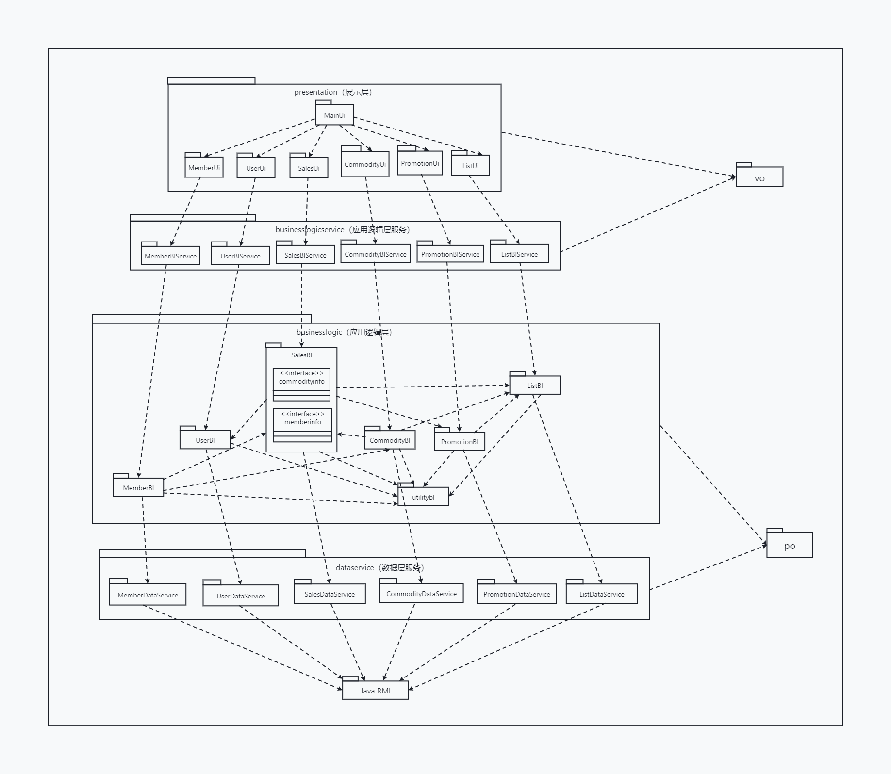
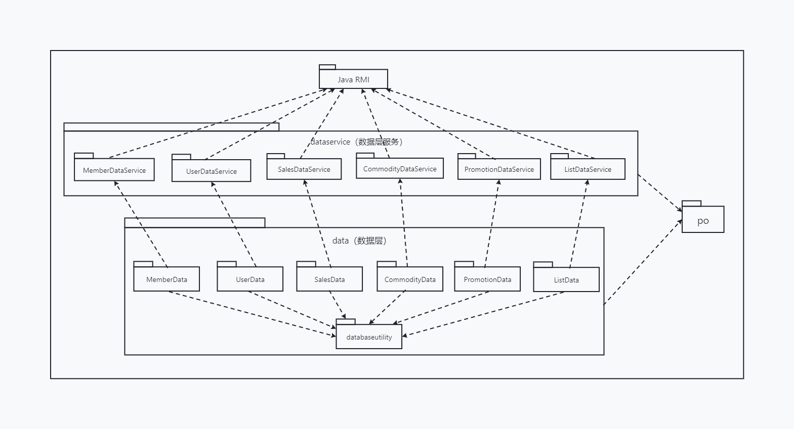
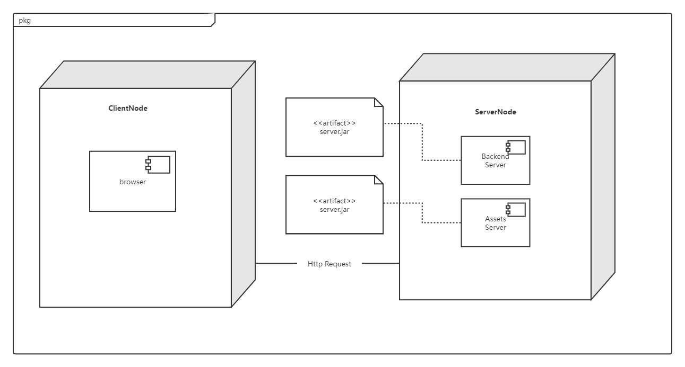

# ERP 系统软件体系结构描述文档

### 引言

##### 编制目的

本报告详细完成对 ERP 系统的概要设计，达到指导详细设计和开发的目的，同时实现和测试人员及用户的沟通。本报告面向开发人员、测试人员及最终用户而编写，是了解系统的导航。

##### 词汇表

| 词汇名称 | 词汇含义 | 备注   |
| -------- | -------- | ------ |
| ......   | ......   | ...... |
| ......   | ......   | ...... |

##### 参考资料

......

### 产品概述

本产品是一套为了让规模扩大的民营企业适应新的环境，提高 工作效率和用户满意度而开发的 ERP 系统。该系统主要包括库存管理、销售管理、财务管理、人事管理和企业经营管理。

### 逻辑视角

ERP 系统中，选用了分层体系结构风格，将体系分为 3 层（展示层、业务逻辑层、数据层）能够很好地示意整个高层抽象。展示层包含 GUI 页面的实现，业务逻辑层包含业务逻辑处理的实现，数据层负责数据的持久化和访问。分层体系结构的逻辑视角和逻辑设计方案如下图所示。

### 组合视角

##### 开发包图

ERP 系统的最终开发包设计如下表。

| 开发（物理）包       | 依赖的其他开发包                                             |
| -------------------- | ------------------------------------------------------------ |
| mainui               | promotionui, saleui, commodityui, financeui, customui, purchaseui, employeeui, userui, vo |
| promotionui          | promotionblservice, 界面类库包                               |
| promotionblservice   |                                                              |
| promotionbl          | promotionblservice, promotiondataservice, po                 |
| promotiondataservice | Java RMI, po                                                 |
| promotiondata        | Java RMI, po, databaseutility                                |
| saleui               | saleblservice, 界面类库包                                    |
| saleblservice        |                                                              |
| salebl               | saleblservice, saledataservice, commoditybl, custombl, userbl, promotionbl, po |
| saledataservice      | Java RMI, po                                                 |
| saledata             | Java RMI, po, databaseutility                                |
| commodityui          | commodityblservice, 界面类库包, vo                           |
| commodityblservice   |                                                              |
| commoditybl          | commodityblservice, commoditydataservice, salebl, po         |
| commoditydataservice | Java RMI, po                                                 |
| commoditydata        | Java RMI, po, databaseutility                                |
| financeui            |                                                              |
| financeblservice     |                                                              |
| financebl            | financeblservice, financedataservice, salebl, purchasebl, userbl, custombl, po |
| financedataservice   | Java RMI, po                                                 |
| financedata          | Java RMI, po, databaseutility                                |
| customui             | customblservice, 界面类库包, vo                              |
| customblservice      |                                                              |
| custombl             | customblservice, customdataservice, po                       |
| customdataservice    | Java RMI, po                                                 |
| customdata           | Java RMI, po, databaseutility                                |
| purchaseui           | purchaseblservice, 界面类库包                                |
| purchaseblservice    |                                                              |
| purchasebl           | purchaseblservice, purchasedataservice, custombl, userbl, po |
| purchasedataservice  | Java RMI, po                                                 |
| purchasedata         | Java RMI, po, databaseutility                                |
| employeeui           | employeeblservice, 界面类库包, vo                            |
| employeeblservice    |                                                              |
| employeebl           | employeeblservice, employeedataservice, userbl, po           |
| employeedataservice  | Java RMI, po                                                 |
| employeedata         | Java RMI, po, databaseutility                                |
| userui               | userblservice, 界面类库包, vo                                |
| userblservice        |                                                              |
| userbl               | userblservice, userdataservice, po                           |
| userdataservice      | Java RMI, po                                                 |
| userdata             | Java RMI, po, databaseutility                                |
| vo                   |                                                              |
| po                   |                                                              |
| utilitybl            |                                                              |
| 界面类库包           |                                                              |
| Java RMI             |                                                              |
| databaseutility      | JDBC                                                         |

ERP 系统客户端开发包图和服务器端开发包图如下所示。

##### 物理部署

ERP 系统中客户端构件是放在客户端机器上，服务器端构建是放在服务器端机器上。在客户端节点上，还要部署 RMIStub 构件。由于 Java RMI 构件属于 JDK 8.0 的一部分，所以在系统 JDK 环境已经设置好的情况下，不需要再独立部署。部署图如下所示。

### 接口视角

### 信息视角
